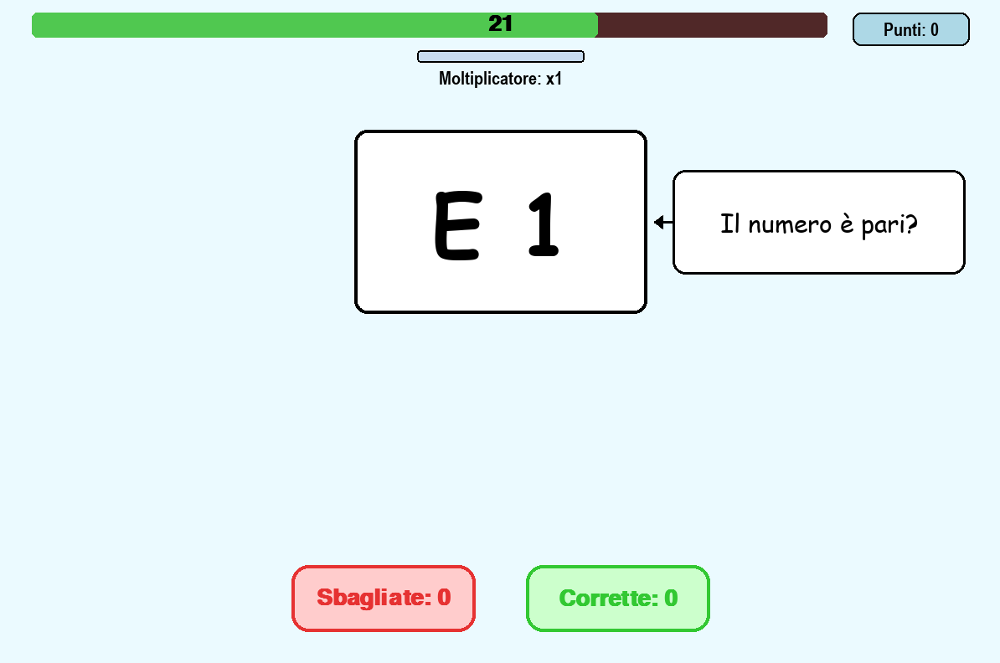

# Brain Shift — progetto di gruppo

## Chi siamo

- Zullo Alessandro — alessandro.zullo@jcmaxwell.it / shishalex
- Duvarrini Loris — loris.duvarrini@jcmaxwell.it / loris-duva

Classe 4A Informatica — a.s. 2025-26.

## Cos'è Brain Shift

Brain Shift è un gioco di velocità e memoria. Il gioco consiste in un'apparizione di una card al centro dello schermo con all'interno una lettera e un numero.

In base al posizionamento della carta dovrai rispondere alla domanda: "E' Pari?" o "E' una vocale?", 
rispondendo sì o no.

Il gioco possiede oltre ad un sistema di punteggio classico, che aggiunge 10 punti ad ogni risposta corretta e -5 ad una sbagliata, 
è implementato un sistema moltiplicatore.

Con il moltiplicatore, facendo 3 risposte corrette di file aumenta e moltiplica il punteggio. 
Se sbagli una domanda perdi il moltiplicatore.
Con il time

## Come giocare

Istruzioni minime ma complete per far partire il gioco da clone pulito:

```bash
git clone https://github.com/shishalex/brain_shift_Zullo-Duvarrini
cd brain_shift_Zullo-Duvarrini
pip install -r requirements.txt
python main.py
```

Specificate:

- versione Python richiesta: Python 3.11 - Python 3.13
- versione pygame richiesta: 2.6.1
- versione pytest richiesta: 9.0.3

## Controlli

- ← freccia sinistra: per rispondere **SÌ** alla domanda
- → freccia destra: per rispondere **NO** alla domanda

## Screenshot



## Struttura del repository

Breve spiegazione di dove sta cosa:

```
brain_shift/
├── main.py           ← entry point
├── ui.py             ← interfaccia grafica
├── rules.py          ← logica regole
├── scoring.py        ← sistema scoring
├── models.py         ← contenitore di classi
├── generator.py      ← generatore di oggetti
├── config.py         ← configurazione per l'interfaccia
├── docs/             ← documentazione
└── tests/            ← test pytest
```

## Come lanciare i test

```bash
pytest tests/
```

---

### Domande-guida per questa pagina

Non vanno lasciate nel file finale, servono solo a voi per capire cosa scrivere.

1. Se un vostro compagno di un'altra classe apre questo repo, capisce in 30 secondi cosa fa il gioco?
2. Le istruzioni di setup sono abbastanza specifiche da funzionare sul suo computer?
3. C'è almeno uno screenshot o una GIF?
4. Tutti i link ad altre pagine di `docs/` sono validi?
