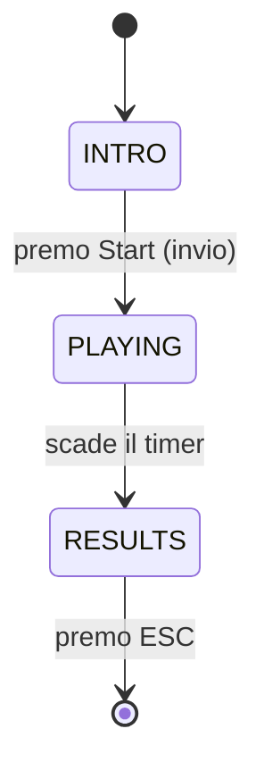

# Architettura

> Qui spiegate **come è fatto dentro** il progetto. Non ripetete il testo della specifica: scrivete cosa avete fatto voi, come lo avete organizzato, e perché.

## Decomposizione in moduli

Per ciascun modulo del vostro progetto, una-due righe:

- `main.py` — File principale
- `config.py` — Configurazioni per la UI
- `models.py` — Classi da utilizzare
- `rules.py` — Parte di logica del gioco
- `scoring.py` — Funzione per controllare la risposta
- `generator.py` — Creatore di oggetti
- `ui.py` — Interfaccia grafica

### Main.py
Nel main del progetto troviamo l'inizializzazione di pygame
e la dichiarazione delle variabili counter (Come punteggio e risposte).
Ritroviamo anche tutta la gestione degli eventi e il disegno della UI.

### Config.py
Nel file config troviamo, elencati e divisi, tutti le costanti utili alla UI
e anche delle funzioni per il timer.

### Models.py
Models.py contine la struttura della dataclass Trial per gestione delle risposte per carta generata.

### Rules.py
Il rules troviamo tutta la logica che ci permette di capire se un numero è pari o una lettera è una vocale e, in base alla posizione, decidere cosa controllare.
Questa è una parte chiave della logica di gioco.

### Scoring.py
In scoring.py è contenuta una singola funzione che assegna il punteggio in base se la
risposta data è sbagliata o corretta, assegnando un moltiplicatore al quelle giuste.

### Generator.py
Generator.py è un file che, tramite la dataclass che troviamo in trials.py, crea una
nuova carta effettiva che poi verrà passata alla UI per essere visualizzata e funzionare nella partita.

### UI.py
In questo file troviamo tutta la gestione dell'interfaccia grafica. Sono presenti tutte
le funzioni che ci permettono di disegnare i componenti del gioco prendendo le costanti da config.py.

## Macchina a stati

Diagramma della macchina a stati:

### Avvio
Quando avviamo il gioco ci si para davanti una schermata che ci chiede di premere invio per iniziarea giocare.
### Playing
Appaino tutti gli elementi grafici del gioco e si possono usare i comandi per dare le risposte.
Quando il timer di 30 secondi finisce, appare la schermata dei risultati.
### Results
Appare una finestra dove viene mostrato il punteggio totalizzato con un piccolo bonus.

Si può premere poi esc per chiudere il gioco.

## Flusso di un trial

Descrivete il ciclo di vita di un singolo trial, dall'istante in cui il generatore lo crea all'istante in cui viene archiviato nelle statistiche. Dove nasce? Come viene valutato? Chi aggiorna lo scoring? Chi attiva il feedback?

Un diagramma di sequenza Mermaid aiuta molto qui.

## Dati principali

Le vostre `dataclass` principali (`Trial`, `ScoringState`, `SessionStats`): cosa contengono, chi le crea, chi le modifica.

## Scoring: come è implementato

Due righe di riassunto del sistema (meter, moltiplicatore, bonus) e riferimento al file dove sta il codice. Non ripetete la formula della specifica — spiegate come l'avete tradotta in codice voi.

## Generatore: bilanciamento e seed

- Come evitate streak lunghe?
- Come bilanciate YES/NO?
- Come funziona il seed? Come lo testate?

## Fading istruzioni

Come è implementato tecnicamente? Dove vive la variabile «quante risposte corrette finora»? Chi la aggiorna? Come si trasforma in opacità?

---

### Domande-guida

1. Se un compagno apre il progetto per la prima volta, capisce dove cercare cosa?
2. Avete spiegato **perché** le vostre scelte, o solo **cosa** avete fatto?
3. I diagrammi Mermaid si aprono correttamente su GitHub? (Verificate nel browser.)
4. Qualcuno che legge solo questa pagina riesce a farsi un'idea corretta dell'architettura?
